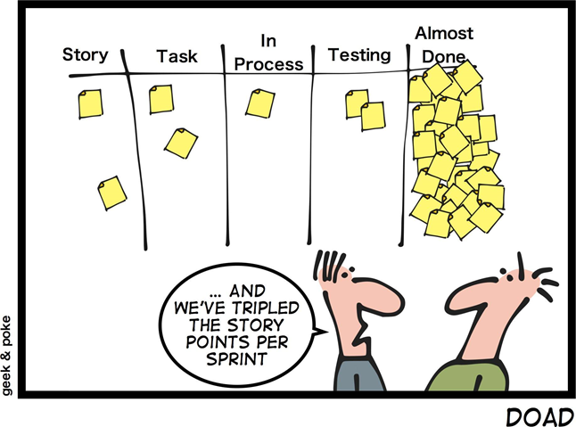

# Definition of Done (DoD)

## Overview

- This technique helps:
    - Identify all activities which need to be completed for the user story to meet the customer needs
    - Bring all participants of the product development to the common understanding when the user story should be considered done
    - Reduce risks, as all activities are listed there is less risk that some important activity will be missed

> Definition of Done is a technique where the team agrees on, and prominently displays, a list of criteria which must be met before a backlog item is considered done.

- [Agile Extension to the BABOK ® Guide](https://www.agilealliance.org/wp-content/uploads/2017/08/AgileExtension_V2-Member-Copy.pdf)

## Who create DoD?

- That is the team has to create a well-defined, unambiguous, measurable, agreed-upon, and shared Definition of Done between all team members

## What does DoD look like?

- The best form of DoD representation is a checklist of activities that has to demonstrate the agreed value and quality of a user story
    - Acceptance criteria (to satisfy customer requirements for a product)
    - Quality criteria (to satisfy quality requirements for a product)

## The scope of DoD

- DoD may be defined for different levels of project work. For example, in Agile / Scrum framework these levels of work could be
    - User Story
    - Sprint,
    - Release

## Examples,

### Example of DoD for a User Story

- Code completed
    - Code is written
    - Code is in agreed standard format
    - Code is merged into developo branch
    - Code review is completed

- Build is deployed to the testing environment

- Tested
    - Unit tests are all passed
    - Acceptance criteria are met
    - Non-functional requirements are met
    - UI Automation tests are passed
    - All known bugs are fixed

### Example of DoD for a Sprint

- DoD of all user stories are met
- Build is deployed to the integration environment
- Tested
    - All known bugs are fixed
    - Regression tests are passed
    - integration tests are all passed
    - Performance tests are all passed
- Product backlog is updated
- Design documentation is updated

### Example of DoD for a Release

DoD for a sprint is met

- Compliance requirements are met
- End-to-end testing is completed
- End-user documentation is updated
- Release notes are written
- Build is deployed to the production environment

## Summary

### Decreasing misunderstanding

- We no longer have to ask “how done are you?”

- With DoD, it is visible for all team members and customer representatives

### Decreasing risk of delay and budget overrun

- With DoD, the team has a clear vision from the beginning of what it takes to
make the user story / sprint / release completely done, not “nearly done”

- Thus, the cost of rework, delay and customer dissatisfaction are decreased

### Ensuring the user story / sprint / release success

- With a clearly defined Definition of Done agreed value and quality of the product is brought to the customer
